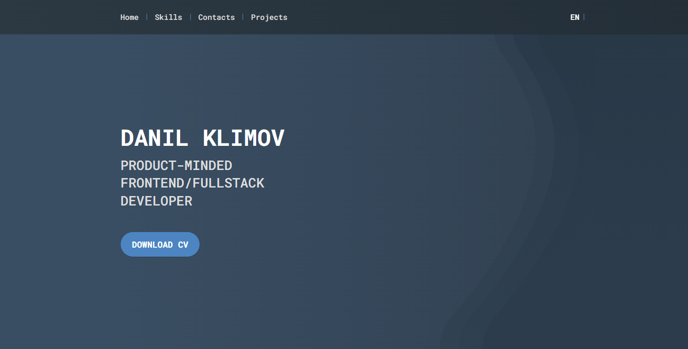

# Personal Landing Page / Portfolio

A Clean, Responsive, and Localized Static Website

---

## Project Overview

This repository hosts the source code for my personal landing page, designed as a minimalist yet highly functional online presence. Developed with a focus on **clean aesthetics, optimal performance, and user experience**, this project showcases my core frontend development skills in a pure web environment, without the overhead of JavaScript frameworks.

The site features a **fully responsive design** tailored for seamless viewing across all devices, from mobile phones to large desktop screens. It also includes a **dynamic dark/light theme switcher** and a **custom localization system** supporting multiple languages (currently Russian and English), providing a personalized experience for visitors. All content is managed through `.json` files, demonstrating a structured approach to content delivery and maintainability.

This project serves as a clear example of how a modern, performant, and accessible static website can be built efficiently using contemporary tools like Vite and Tailwind CSS, coupled with custom TypeScript logic for interactive elements.

---

## Features

This landing page implements key features focused on user interaction and accessibility:

* **Responsive and Adaptive Design:** Built with **Tailwind CSS**, ensuring a clean, modern, and fully responsive layout that adapts gracefully to various screen sizes and orientations.
* **Dynamic Theme Switching:** Users can toggle between **light and dark modes**, with the preference saved locally, providing a comfortable viewing experience based on their environment.
* **Custom Localization System:** Implements a lightweight, pure **TypeScript** solution for dynamic content localization (Russian and English). Text content, including `title` and `aria-label` attributes, is loaded from external `.json` files, making content updates efficient and scalable.
* **Modular TypeScript Structure:** Core functionalities like theme management and language switching are encapsulated in dedicated TypeScript classes (`ThemeManager.ts`, `LanguageManager.ts`), promoting maintainability and separation of concerns.
* **Minimal JavaScript Footprint:** Achieves rich interactivity with a minimal amount of JavaScript, focusing on performance and fast load times.
* **Vite Powered Development:** Leverages **Vite** for a blazing-fast development server and optimized production builds, ensuring a smooth developer experience and efficient deployment.

---

## Technologies Used

This project is built using a modern and efficient tech stack:

### Frontend:

* **HTML5:** Structured and semantic markup.
* **CSS3 / Tailwind CSS:** Utility-first CSS framework for rapid and consistent styling, including custom theme variables for light/dark modes.
* **TypeScript:** For robust and maintainable client-side logic (theme switching, localization).
* **Vite:** As a lightning-fast build tool, providing a rapid development experience and optimized production builds.

---

## Code Highlights

Reviewing the codebase demonstrates key implementation patterns and architectural decisions:

* **`index.html`:** The main entry point, showcasing semantic HTML structure and the integration of `data-i18n` and `data-i18n-attr` attributes for dynamic content translation.
* **`src/main.ts`:** The central script responsible for initializing `ThemeManager` and `LanguageManager`, demonstrating the application's core logic bootstrapping.
* **`src/themeManager.ts`:** Implements the logic for toggling and persisting user theme preferences (light/dark mode) using local storage and CSS custom properties defined in `src/style.css`.
* **`src/languageManager.ts`:** Handles the dynamic loading and application of localized content from JSON files (`/locales/*.json`), updating `textContent` and various attributes based on the selected language.
* **`src/languageDetector.ts`:** Provides utility functions for detecting preferred language, setting current language, and subscribing to language changes, forming the backbone of the localization system.
* **`src/style.css`:** Integrates Tailwind CSS and defines custom CSS variables for theme-specific colors and other design tokens, demonstrating a scalable approach to styling.
* **`/locales/` directory:** Contains JSON files (e.g., `en.json`, `ru.json`) that define all translatable strings, showcasing a clear separation of content from code.

---

## Screenshots

To fully appreciate the design and responsiveness, here are the key sections you should capture:

* **Desktop Page:** Show the main layout with contact and project sections.
    
* **Dark Mode Example:** Showcase the site in dark mode.
    
* **Mobile Page:** Display the mobile-optimized layout.
    
* **Language Switch Example:** (Optional, if you want to show the functionality) A screenshot showing the language toggle.
    

---

## Project Status

This project is **actively maintained** and serves as my primary personal portfolio and online business card. It is designed to be a living showcase of my skills, with ongoing content updates and potential feature enhancements planned. This repository is a valuable resource for understanding my approach to building performant, accessible, and maintainable static web applications.

---

## Setup

To set up and run this project locally, follow these steps:

1.  **Clone the repository:**
    ```bash
    git clone https://github.com/saakivnzechad/portfolio-website.git
    cd portfolio-website
    ```
2.  **Install Node.js and npm/yarn/pnpm** (if you don't have them).
3.  **Install dependencies:**
    ```bash
    npm install 
    ```
4.  **Run the development server:**
    ```bash
    npm run dev
    ```
    This will typically start a local server at `http://localhost:5173` (or similar).
5.  **Build the production version (optional):**
    ```bash
    npm run build
    ```
    This will generate the `dist` directory with optimized static assets.

---

## Deployment

This project can be easily deployed as a static site to platforms like GitHub Pages. Refer to the project's documentation on deploying Vite projects to GitHub Pages for detailed instructions.

---

## Author

**Danil Klimov**
* GitHub: [@saakivnzechad](https://github.com/saakivnzechad)
* Telegram: [@sarthriles](https://t.me/sarthriles)

---

## License

This project is licensed under the **Mozilla Public License Version 2.0 (MPL 2.0)**.
A copy of the license is available in the `LICENSE` file in this repository.